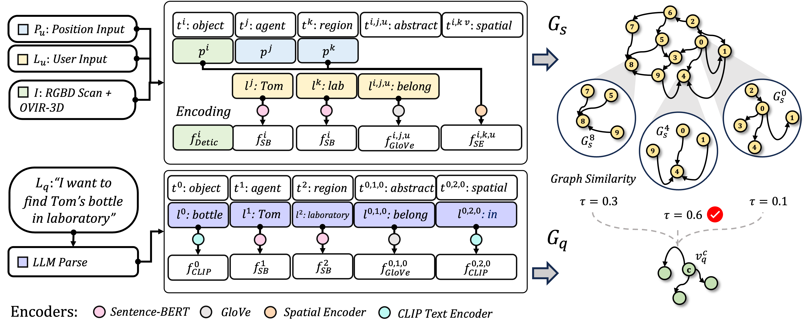

# OVSG

**Context-Aware Entity Grounding with Open-Vocabulary 3D Scene Graphs**, Haonan Chang, Kowndinya Boyalakuntla, Shiyang Lu, Siwei Cai, Eric Jing, Shreesh Keskar, Shijie Geng, Adeeb Abbas, Lifeng Zhou, Kostas Bekris, Abdeslam Boularias

To appear at [CoRL'23](https://www.corl2023.org/).

# Bibtex

```bibtex
@inproceedings{
lu2023ovird,
title={{OVIR}-3D: Open-Vocabulary 3D Instance Retrieval Without Training on 3D Data},
author={Shiyang Lu and Haonan Chang and Eric Pu Jing and Abdeslam Boularias and Kostas Bekris},
booktitle={7th Annual Conference on Robot Learning},
year={2023},
url={https://openreview.net/forum?id=gVBvtRqU1_}
}
```

# Intro

We present an Open-Vocabulary 3D Scene Graph (OVSG), a formal framework for grounding a variety of entities, such as object instances, agents, and regions, with free-form text-based queries. Unlike conventional semantic-based object localization approaches, our system facilitates context-aware entity localization, allowing for queries such as ``pick up a cup on a kitchen table" or ``navigate to a sofa on which someone is sitting". In contrast to existing research on 3D scene graphs, OVSG supports free-form text input and open-vocabulary querying. Through a series of comparative experiments using the ScanNet dataset and a self-collected dataset, we demonstrate that our proposed approach significantly surpasses the performance of previous semantic-based localization techniques. Moreover, we highlight the practical application of OVSG in real-world robot navigation and manipulation experiments.  The code and dataset used for evaluation will be made available upon publication.

# Pipeline Structure



# Example


# Code

Being cleaned. Coming soon.

