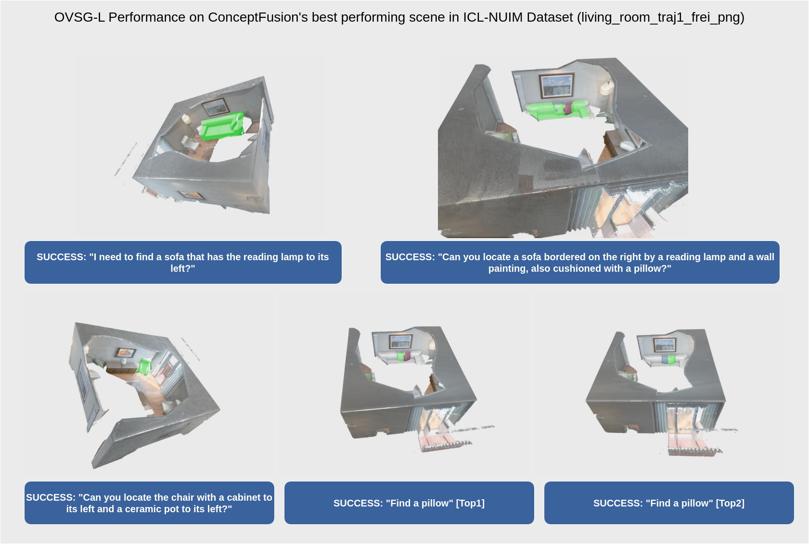

# Offical implementation of OVSG

**Context-Aware Entity Grounding with Open-Vocabulary 3D Scene Graphs**

*Authors: [Haonan Chang](https://github.com/changhaonan/), [Kowndinya Boyalakuntla](https://kowndinya2000.github.io), Shiyang Lu, Siwei Cai, Eric Jing, Shreesh Keskar, Shijie Geng, Adeeb Abbas, Lifeng Zhou, Kostas Bekris, [Abdeslam Boularias](http://www.abdeslam.net/)*

To appear at [CoRL '23](https://www.corl2023.org/).

## Introduction
Welcome to the official implementation of Open-Vocabulary 3D Scene Graphs (OVSG). 

OVSG is a formal framework designed for grounding various entities, including object instances, agents, and regions, using free-form text-based queries. Unlike traditional semantic-based object localization methods, OVSG enables context-aware entity localization, allowing queries like "pick up a cup on a kitchen table" or "navigate to a sofa on which someone is sitting." In contrast to existing 3D scene graph research, OVSG supports open-vocabulary querying and free-form text input. 

We have conducted comparative experiments using the ScanNet dataset and a self-collected dataset [DOVE-G](https://doi.org/10.6084/m9.figshare.24307072.v1), demonstrating that our approach outperforms previous semantic-based localization techniques significantly. Furthermore, we showcase the practical applications of OVSG in real-world robot navigation and manipulation experiments. 

## Example



## Code Example

### Installation Instructions

To get started, clone the OVSG repository:

```bash
git clone https://github.com/changhaonan/OVSG
```
`OVIR-3D` is included as a submodule in `OVSG`. So you'll need to run:

```bash
git submodule update --init --recursive
```

`OVSG` relies on `OVIR-3D` as its backbone, so before installing `OVSG`, please follow the installation instructions provided in the `OVIR-3D` README.

After installing `OVIR-3D`, you can install `OVSG` by running:

```bash
pip install -r requirements.txt
pip install -e .
```

## Running Instructions

Start by downloading the demo data from this [link](https://drive.google.com/file/d/1QZH5IuKMuxcTAf4NMJQKzWCr-M26xLer/view?usp=sharing). Place the data into the `test_data` folder and extract it there. Then, run `OVIR-3D` to perform the fusion:

### Do OVIR-3D Fusion

Running Detic 2D proposal. For `vocabulary`, we can choose `lvis`, `ycb_video`, `scannet200`, `imagenet21k`.
```bash
cd external/OVIR-3D/Detic
python fire.py --dataset ../../../test_data  --vocabulary scannet200
```

Running OVIR-3D fusion
```bash
cd external/OVIR-3D/src
python fire.py --dataset ../../../test_data --stride 1  --detic_exp scannet200-0.3
```

### Running OVSG

Running `OVSG` example with LLM:

> In the `ovsg/config/api` directory, fill in your OpenAI API key and save the file `openai_demo.yaml` as `openai.yaml` instead and then run:
```bash
python example/exp_ovsg_llm.py
```

Running `OVSG` example without LLM:
```bash
python example/example_ovsg_only.py
```

## Evaluation Code

Being cleaned. Coming soon.

## Trouble Shooting

This repo is being actively maintained, feel free to raise problems in GitHub issues.

# DOVE-G dataset

We also provide a new vision language dataset `DOVE-G`. You can download it from this link: [Link](https://doi.org/10.6084/m9.figshare.24307072.v1).

# Bibtex

If you find `OVSG` and `OVIR-3D` useful or relevant to your work, please cite them using the following BibTeX entries:

```bibtex
@inproceedings{
chang2023contextaware,
title={Context-Aware Entity Grounding with Open-Vocabulary 3D Scene Graphs},
author={Haonan Chang and Kowndinya Boyalakuntla and Shiyang Lu and Siwei Cai and Eric Pu Jing and Shreesh Keskar and Shijie Geng and Adeeb Abbas and Lifeng Zhou and Kostas Bekris and Abdeslam Boularious},
booktitle={7th Annual Conference on Robot Learning},
year={2023},
url={https://openreview.net/forum?id=cjEI5qXoT0}
}
```

```bibtex
@inproceedings{
lu2023ovird,
title={{OVIR}-3D: Open-Vocabulary 3D Instance Retrieval Without Training on 3D Data},
author={Shiyang Lu and Haonan Chang and Eric Pu Jing and Abdeslam Boularias and Kostas Bekris},
booktitle={7th Annual Conference on Robot Learning},
year={2023},
url={https://openreview.net/forum?id=gVBvtRqU1_}
}
```